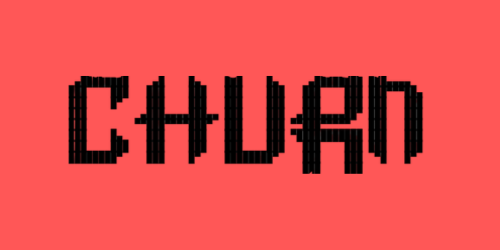

<div align="center">



**Your agents favorite linting layer.**

Open-source • Local-first • Use as-is

[](https://www.npmjs.com/package/churn-cli)
[](https://www.npmjs.com/package/churn-cli)
[](https://opensource.org/licenses/MIT)
[](https://bun.sh)
[](https://www.typescriptlang.org/)
[](https://github.com/cloudboyjh1/churn2.0/pulls)

</div>

---

## Table of Contents

- [Why Churn?](#why-churn)
- [What Churn Finds](#what-churn-finds)
- [What's New in v2.1](#whats-new-in-v21)
- [Quick Start](#quick-start)
- [Features](#features)
- [Installation](#installation)
- [Running Locally with Ollama](#running-locally-with-ollama)
- [Commands](#commands)
- [Configuration](#configuration)
- [Contributing](#contributing)
- [Documentation](#documentation)
- [License](#license)

---

## Why Churn?

**Built for developers, by developers.** Churn is an AI-assisted CLI tool that helps you maintain and refactor codebases with intelligent analysis—all from your terminal.

**What makes Churn different:**

- **Truly Open Source** - MIT licensed, no hidden fees, no telemetry, no account required
- **Local-First** - Your code never leaves your machine unless you choose a cloud model
- **Zero Setup** - Run from any Git repository, no configuration needed to start
- **Model Freedom** - Use Claude, GPT, Gemini, or run completely offline with Ollama
- **Production Ready** - v2.1+ is stable and actively maintained
- **Cost Conscious** - Smart caching, adaptive prompts, and staged mode reduce API costs by 70-90%
- **Beautiful Terminal UI** - Clean, focused interface that doesn't get in your way

Churn respects your workflow, your privacy, and your budget.

---

## What Churn Finds

**Real analysis outcomes from actual projects:**

```bash
✓ Removed 47 unused imports across 23 TypeScript files
✓ Detected 12 orphaned utility functions with no references
✓ Flagged 8 dependencies not imported anywhere in src/
✓ Identified 5 performance bottlenecks in rendering loops
✓ Caught 3 security anti-patterns (exposed API keys, eval usage)
✓ Suggested 15 complex functions that would benefit from breaking down
✓ Found 9 TODO comments older than 6 months
✓ Detected duplicate logic across 4 similar components
```

**Common use cases:**

- **Pre-commit checks** - Use `--staged` to analyze only your changes before committing (90% faster)
- **Cleanup before release** - Find dead code, unused dependencies, and orphaned files
- **Onboarding new developers** - Generate a "health report" of technical debt
- **Pre-PR review** - Catch issues before they hit CI/CD with language-specific analysis
- **Refactoring planning** - Identify high-impact areas to improve
- **Dependency audits** - Flag outdated or unused packages
- **Security scanning** - Detect common anti-patterns and vulnerabilities
- **Framework migration** - Get context-aware suggestions for your specific stack

Churn gives you **actionable insights**, not just observations. Every finding includes context, severity, and suggested fixes tailored to your language and framework.

---

## What's New in v2.1

**Smarter, Faster, Cheaper Analysis** - Version 2.1 introduces intelligent context-aware analysis and differential staged mode:

**Adaptive Prompts (v2.1.0)**
- Language-specific analysis tailored to TypeScript/React, Python, Rust, Go, and more
- Framework detection (Next.js, React, FastAPI, Django) for context-aware suggestions
- Smart config file handling (0-2 suggestions max, security-focused)
- Real-time token tracking and cost estimation
- 30-50% token reduction through focused, relevant prompts

**Differential Analysis (v2.1.1)**
- Staged mode now analyzes only changed lines, not entire files
- 70-90% token reduction for `churn run --staged` workflow
- Perfect for pre-commit checks and pull request reviews
- Automatic fallback to full analysis when needed

**Stability Improvements (v2.0.13)**
- Fixed infinite re-rendering bug in analysis summary
- Clean, single-render completion screen
- Rock-solid analysis execution

**See [CHANGELOG.md](./CHANGELOG.md) for complete version history.**

---

## Quick Start

**Get your first analysis in 30 seconds:**

```bash
# Install globally
npm install -g churn-cli

# Navigate to your project
cd your-project

# Run analysis
churn start
```

That's it. Churn will:
1. Detect your repository and project type
2. Prompt you to select an AI model (first run only)
3. Show you what it's about to analyze
4. Stream results in real-time
5. Let you review and accept/reject suggestions
6. Export patches and reports

**First-time users:** Start with `churn start` for an interactive experience. The tool will guide you through model selection and configuration.

**Want to run locally with zero API costs?** See [Running Locally with Ollama](#running-locally-with-ollama) for setup instructions with free, offline models.

**Cost-conscious?** Churn shows real-time token usage and cost estimation during analysis. Combined with smart caching and staged mode, you can reduce API costs by 70-90% while maintaining high-quality insights.

---

## Features

- **Zero-Setup** - Run from any Git repository, no cloning or configuration required
- **Local-First** - All data stored on your machine under `~/.churn/` and `.churn/`
- **Multi-Model Support** - Claude, GPT, Gemini, or local Ollama models
- **Adaptive Analysis** - Language and framework-aware prompts for context-specific suggestions
- **Differential Mode** - Analyze only changed lines in staged files (70-90% cost savings)
- **Live Analysis** - Real-time streaming output with progress tracking
- **Interactive Review** - Navigate and selectively accept suggestions
- **Export Workflow** - Generate patches, reports, and JSON for downstream tools
- **Smart Caching** - Content-based caching reduces repeat analysis costs by 70%
- **Token Tracking** - Real-time cost estimation and transparency
- **Parallel Processing** - Concurrent file analysis for 10x speed improvements
- **Beautiful UI** - Clean, vibrant red-themed terminal interface powered by Ink

---

## Installation

### Quick Install (Recommended)

```bash
# Using npm
npm install -g churn-cli

# Using Bun (faster, recommended)
bun install -g churn-cli

# Using pnpm
pnpm install -g churn-cli

# Using yarn
yarn global add churn-cli
```

**Note:** Churn is built with Bun. While it works with npm/yarn/pnpm, using Bun ensures the best experience.

### For Development

**Requirements:** Bun 1.x (NOT Node.js)

```bash
# Clone the repository
git clone https://github.com/cloudboyjh1/churn2.0.git
cd churn2.0

# Install dependencies with Bun
bun install

# Run in development mode
bun run dev

# Build
bun run build

# Type check
bun run type-check
```

**Important:** This project requires Bun. Do not use `npm install` for development as it may cause dependency issues.

---

## Running Locally with Ollama

**Zero API costs. Run Churn completely offline with local models.**

### Quick Setup

```bash
# 1. Install Ollama (macOS/Linux)
curl -fsSL https://ollama.com/install.sh | sh

# Windows - Download from https://ollama.com/download

# 2. Pull a recommended model
ollama pull deepseek-r1:latest

# 3. Run Churn
cd your-project
churn start
# Select "Ollama" when prompted for provider
```

**Recommended models:** `deepseek-r1:latest`, `qwen2.5-coder:14b`, `phi-3-mini`, `mistral:7b`

**More Information:**
- [Ollama Documentation](https://ollama.com/docs)
- [Browse Models](https://ollama.com/library)

---

## Commands

### `churn start`

Launch interactive menu with options to run analysis, choose model, or exit.

```bash
churn start
```

**Menu Options:**
- **Run scan** - Start code analysis with current model
- **Choose model** - Select or switch AI provider/model
- **Exit** - Quit the application

### `churn run`

Direct code analysis for power users (no interactive menu).

**Options:**
- `-s, --staged` - Analyze only staged files using differential analysis (analyzes only changed lines)
- `-f, --files <files...>` - Analyze specific files
- `-c, --concurrency <number>` - Number of files to analyze in parallel (1-50)

**Examples:**
```bash
# Pre-commit check - analyze only your changes
git add .
churn run --staged

# Analyze specific files
churn run --files src/components/Button.tsx src/utils/helpers.ts

# Full repo scan with higher concurrency
churn run --concurrency 20
```

### `churn model`

Select or change your AI model provider.

```bash
churn model
```

Supports:
- **Anthropic** (Claude Sonnet 4.5, Opus 4.1, Haiku 4.5, Sonnet 4)
- **OpenAI** (GPT-5, GPT-5 Mini, GPT-5 Nano, GPT-5 Pro)
- **Google** (Gemini 2.5 Pro, Gemini 2.5 Flash, Gemini 2.5 Flash-Lite, Gemini 2.0 Flash)
- **Ollama** (Local models like Llama 3.3, DeepSeek-R1, Qwen 2.5, Mistral, CodeLlama)

### `churn review`

Review results from the last analysis.

```bash
churn review
```

**Navigation:**
- Arrow keys - Navigate between suggestions
- Enter - View details
- Space - Toggle acceptance
- Q - Quit review

### `churn export`

Export the last analysis to files.

```bash
churn export
```

**Generated files (saved to `.churn/patches/`):**
- `suggestions-<timestamp>.json` - Full analysis results in JSON format
- `report-<timestamp>.md` - Human-readable markdown report with summary
- `changes-<timestamp>.patch` - Git patch file (if applicable)

**Analysis summary includes:**
- Files analyzed and cache hits
- Tokens used and saved
- Estimated cost and savings
- Project type and framework detected
- All suggestions with severity levels

### `churn pass`

Pass the analysis report to another LLM or tool.

```bash
churn pass --to claude
churn pass --to json | jq '.analysis.suggestions'
```

Outputs the full `churn-reports.json` to stdout for piping.

---

## Keyboard Shortcuts

Churn includes global keyboard shortcuts that work on every screen:

| Key | Action | Description |
|-----|--------|-------------|
| `z` | **Exit** | Exit the application from anywhere |
| `o` | **Start Over** | Return to the start menu |
| `esc` | **Go Back** | Go back one step in the workflow |
| `r` | **Replace Key** | Replace API key (when viewing model selection) |

**Review Panel Shortcuts:**
- `↑` / `↓` - Navigate between suggestions
- `Enter` - View suggestion details
- `Space` - Toggle suggestion acceptance
- `a` - Accept all suggestions
- `n` - Accept none (clear all)
- `d` - Done (proceed to export)
- `q` - Quit review mode

**Note:** Shortcuts are displayed in the footer on each screen for convenience.

---

## Configuration

### Global Config (`~/.churn/config.json`)

```json
{
  "version": "2.1.0",
  "apiKeys": {
    "anthropic": "sk-ant-...",
    "openai": "sk-...",
    "google": "AI..."
  },
  "defaultModel": {
    "provider": "anthropic",
    "model": "claude-sonnet-4-5"
  }
}
```

**Note:** Ollama models don't require API keys and run completely locally.

### API Keys

Churn requires API keys for cloud models:

- **Anthropic**: [console.anthropic.com](https://console.anthropic.com/)
- **OpenAI**: [platform.openai.com](https://platform.openai.com/)
- **Google**: [makersuite.google.com](https://makersuite.google.com/)
- **Ollama**: Run locally, no key needed

Keys are stored in `~/.churn/config.json` and never sent anywhere except the respective API providers.

---

## Contributing

Churn is open-source and welcomes contributions.

**How to Contribute:**
1. Fork the repository
2. Create a feature branch (`git checkout -b feature/amazing-feature`)
3. Make your changes and test thoroughly
4. Commit your changes (`git commit -m 'Add amazing feature'`)
5. Push to your branch (`git push origin feature/amazing-feature`)
6. Open a Pull Request

[Report bugs or request features](https://github.com/cloudboyjh1/churn2.0/issues)

---

## License

MIT License - see [LICENSE](LICENSE) for details.

Copyright (c) 2025 Churn Contributors

---

## Acknowledgments

Built with [Ink](https://github.com/vadimdemedes/ink), powered by [Bun](https://bun.sh), themed in vibrant red.

Special thanks to the open-source community and all contributors who make Churn better.

---

<div align="center">

**Star the repo if you find Churn useful!**

[Report Bug](https://github.com/cloudboyjh1/churn2.0/issues) • [Request Feature](https://github.com/cloudboyjh1/churn2.0/issues) • [Contribute](https://github.com/cloudboyjh1/churn2.0/pulls)

Made with care for developers everywhere.

</div>
